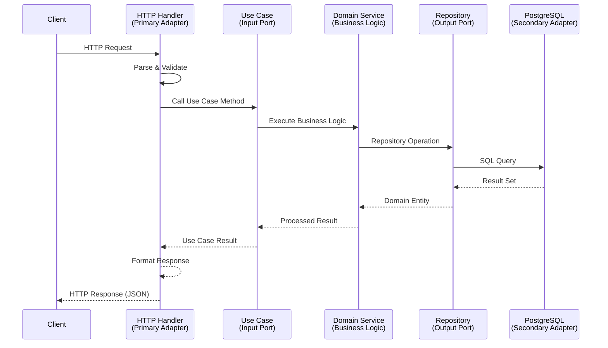
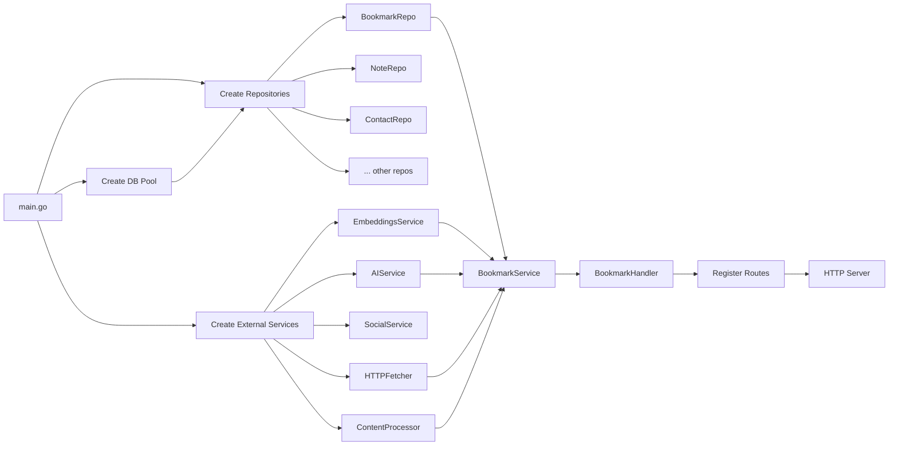
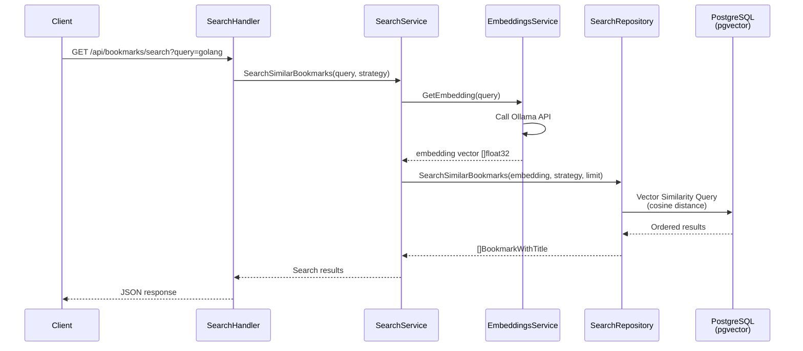
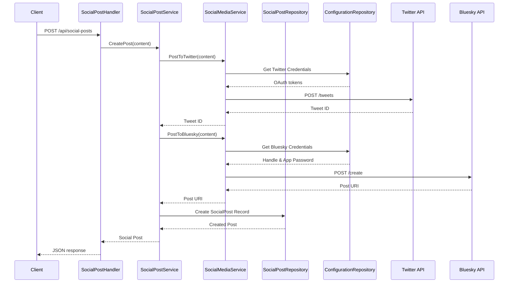
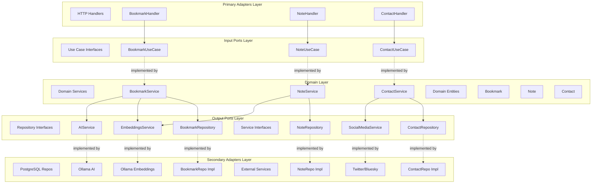

# Architecture Documentation

## Table of Contents

1. [Hexagonal Architecture Overview](#hexagonal-architecture-overview)
2. [Layer Explanations](#layer-explanations)
3. [Dependency Injection Patterns](#dependency-injection-patterns)
4. [Interface Boundaries](#interface-boundaries)
5. [Data Flow Diagrams](#data-flow-diagrams)
6. [Design Decisions and Rationale](#design-decisions-and-rationale)
7. [Directory Structure](#directory-structure)

## Hexagonal Architecture Overview

This project implements **Hexagonal Architecture** (also known as Ports and Adapters architecture), a pattern that promotes separation of concerns and maintains the business logic independent of external systems.

### Core Principles

The architecture follows these fundamental principles:

1. **Business logic independence**: The domain layer has no dependencies on external systems
2. **Dependency inversion**: Dependencies point inward toward the domain, never outward
3. **Testability**: Each layer can be tested independently through well-defined interfaces
4. **Flexibility**: External systems (databases, APIs, UI) can be swapped without affecting business logic

### Architecture Layers

```
┌─────────────────────────────────────────────────────────────┐
│                     PRIMARY ADAPTERS                        │
│              (HTTP Handlers, CLI, etc.)                     │
│                  /adapter/primary/http                      │
└──────────────────────────┬──────────────────────────────────┘
                           │
                           ▼
┌─────────────────────────────────────────────────────────────┐
│                      INPUT PORTS                            │
│                 (Use Case Interfaces)                       │
│                     /port/input                             │
└──────────────────────────┬──────────────────────────────────┘
                           │
                           ▼
┌─────────────────────────────────────────────────────────────┐
│                     DOMAIN LAYER                            │
│              /domain/entity + /domain/service               │
│                                                             │
│  • Business Entities (Bookmark, Note, Contact, etc.)       │
│  • Business Logic (Services implementing use cases)        │
│  • Business Rules & Validation                             │
└──────────────────────────┬──────────────────────────────────┘
                           │
                           ▼
┌─────────────────────────────────────────────────────────────┐
│                     OUTPUT PORTS                            │
│               (Repository Interfaces)                       │
│                    /port/output                             │
└──────────────────────────┬──────────────────────────────────┘
                           │
                           ▼
┌─────────────────────────────────────────────────────────────┐
│                   SECONDARY ADAPTERS                        │
│         (PostgreSQL, AI Services, Social Media)             │
│                  /adapter/secondary                         │
└─────────────────────────────────────────────────────────────┘
```

## Layer Explanations

### 1. Domain Layer

The **domain layer** is the heart of the application, containing pure business logic with zero dependencies on external systems.

#### Location
- **Entities**: `/internal/domain/entity/`
- **Services**: `/internal/domain/service/`

#### Domain Entities

Domain entities represent core business concepts and are pure data structures:

```go
// Example: Bookmark entity
type Bookmark struct {
    BookmarkID   uuid.UUID
    URL          string
    CreationDate time.Time
}

type BookmarkDetails struct {
    BookmarkID    uuid.UUID
    URL           string
    CreationDate  time.Time
    CategoryName  *string
    Title         *string
    Summary       *string
    Questions     []BookmarkQuestion
    // ... additional fields
}
```

**Key entities include:**
- `Bookmark` - Web bookmarks with content processing
- `Note` - User notes with vector embeddings
- `Contact` - Contact management
- `Room` - Chat/conversation rooms
- `Message` - Chat messages
- `Session` - Conversation sessions
- `SocialPost` - Social media posts
- `Entity` - Generic entity references (for Logseq integration)
- `Category` - Categorization system
- `Tag` - Tagging system
- `Item` - Generic items
- `Observation` - System observations/logs
- `BrowserHistory` - Browser history tracking

#### Domain Services

Domain services implement business logic and orchestrate operations:

```go
type BookmarkService struct {
    repo              output.BookmarkRepository
    httpFetcher       output.HTTPFetcher
    embeddingsService output.EmbeddingsService
    aiService         output.AIService
    contentProcessor  output.ContentProcessor
}
```

**Key responsibilities:**
- Implement business use cases
- Orchestrate calls to multiple repositories/services
- Enforce business rules and validation
- Transform data between layers
- Coordinate complex workflows (e.g., fetch → process → embed → summarize)

**Example workflow** (Bookmark content processing):
1. Fetch HTTP content via `httpFetcher`
2. Process content with reader mode via `contentProcessor`
3. Generate embeddings via `embeddingsService`
4. Create summary via `aiService`
5. Store all results via `repo`

### 2. Primary Adapters (HTTP Handlers)

Primary adapters handle incoming requests and translate them into domain operations.

#### Location
- `/internal/adapter/primary/http/handler/`
- `/internal/adapter/primary/http/server.go`

#### HTTP Handlers

Handlers are thin translation layers that:
1. Parse HTTP requests
2. Validate input data
3. Call use cases through input ports
4. Format responses

```go
type BookmarkHandler struct {
    useCase input.BookmarkUseCase  // Dependency on INPUT PORT, not service
}

func (h *BookmarkHandler) GetBookmark(w http.ResponseWriter, r *http.Request) {
    // 1. Extract and validate parameters
    bookmarkID, err := uuid.Parse(chi.URLParam(r, "id"))

    // 2. Call use case through port interface
    details, err := h.useCase.GetBookmarkDetails(ctx, bookmarkID)

    // 3. Format and return response
    json.NewEncoder(w).Encode(details)
}
```

**Handler responsibilities:**
- HTTP-specific concerns (routing, status codes, headers)
- Request parsing and validation
- Response formatting (JSON encoding)
- Error handling and HTTP error codes
- **NOT** business logic (delegated to domain services)

**Available handlers:**
- `BookmarkHandler` - Bookmark management and processing
- `NoteHandler` - Note CRUD and search
- `ContactHandler` - Contact management
- `RoomHandler` - Chat room operations
- `MessageHandler` - Message handling
- `SessionHandler` - Session management
- `SocialPostHandler` - Social media posting
- `SearchHandler` - Vector search operations
- `TagHandler` - Tag management
- `ItemHandler` - Item management
- `LogseqHandler` - Logseq integration
- `DashboardHandler` - Dashboard data
- `UtilityHandler` - Utility operations

#### HTTP Server

The server provides:
- Chi router configuration
- Middleware stack (logging, recovery, CORS, timeouts)
- Graceful shutdown
- Route registration

```go
// Middleware stack
r.Use(middleware.RequestID)
r.Use(middleware.RealIP)
r.Use(middleware.Logger)
r.Use(middleware.Recoverer)
r.Use(middleware.Timeout(60 * time.Second))
r.Use(corsMiddleware)
```

### 3. Secondary Adapters

Secondary adapters implement output ports to interact with external systems.

#### Location
- `/internal/adapter/secondary/`

#### Adapter Types

##### A. PostgreSQL Repositories

**Location**: `/internal/adapter/secondary/postgres/repository/`

Implement data persistence using PostgreSQL with pgx driver:

```go
type BookmarkRepository struct {
    pool *pgxpool.Pool  // PostgreSQL connection pool
}

func (r *BookmarkRepository) GetBookmark(ctx context.Context, bookmarkID uuid.UUID) (*entity.Bookmark, error) {
    queries := db.New(r.pool)  // sqlc-generated queries
    dbBookmark, err := queries.GetBookmark(ctx, bookmarkID)

    // Convert database model to domain entity
    return &entity.Bookmark{
        BookmarkID:   dbBookmark.BookmarkID,
        URL:          dbBookmark.Url,
        CreationDate: dbBookmark.CreationDate.Time,
    }, nil
}
```

**Features:**
- Uses sqlc for type-safe SQL queries
- Connection pooling with pgxpool
- Vector similarity search with pgvector
- Prepared statements for performance
- Transaction support

**Available repositories:**
- `BookmarkRepository` - Bookmark persistence
- `NoteRepository` - Note storage with embeddings
- `ContactRepository` - Contact data
- `RoomRepository` - Chat room data
- `MessageRepository` - Message storage
- `SessionRepository` - Session management
- `SocialPostRepository` - Social post tracking
- `EntityRepository` - Generic entity storage
- `CategoryRepository` - Category management
- `TagRepository` - Tag operations
- `ItemRepository` - Item persistence
- `ObservationRepository` - Observation logs
- `DashboardRepository` - Dashboard queries
- `BrowserHistoryRepository` - Browser history
- `SearchRepository` - Search operations

##### B. AI Services

**Location**: `/internal/adapter/secondary/ai/`

Implements AI operations using Ollama API:

```go
type Service struct {
    serviceURL string
    apiKey     string
    client     *http.Client
}

func (s *Service) GenerateSummary(ctx context.Context, content, url string, maxWords int) (string, error) {
    // Build prompt
    prompt := fmt.Sprintf("I have read the following article of url %s:\n\n===\n%s\n===\nNow, what would be your summary?", url, content)

    // Call Ollama API
    // Process response
    // Strip thinking tags
    return summary, nil
}
```

**Capabilities:**
- Content summarization
- Configurable word limits
- Response post-processing (stripping thinking tags)
- HTTP client with timeouts

##### C. Embedding Services

**Location**: `/internal/adapter/secondary/embedding/`

Provides text embedding generation with automatic chunking:

```go
type OllamaEmbeddingsService struct {
    baseURL   string
    model     string
    chunkSize int  // Default: 8000 characters
}

func (s *OllamaEmbeddingsService) GetEmbedding(ctx context.Context, text string) ([]entity.Embedding, error) {
    // 1. Chunk text intelligently (sentence boundaries)
    chunks := s.chunkText(text)

    // 2. Generate embedding for each chunk
    for _, chunk := range chunks {
        embedding := s.getEmbeddingForChunk(ctx, chunk)
        embeddings = append(embeddings, embedding)
    }

    return embeddings, nil
}
```

**Features:**
- Automatic text chunking (respects sentence boundaries)
- Configurable chunk size
- Supports both single and chunked embeddings
- Uses nomic-embed-text model by default

**Two variants:**
- `EmbeddingService` - Single embedding per text
- `EmbeddingsService` - Multiple chunked embeddings

##### D. Social Media Services

**Location**: `/internal/adapter/secondary/social/`

Integrates with social media platforms:

```go
func (s *Service) PostToTwitter(ctx context.Context, content string) (string, error)
func (s *Service) PostToBluesky(ctx context.Context, content string) (string, error)
```

**Capabilities:**
- Twitter OAuth flow
- Bluesky authentication
- Credential validation
- Post publishing

##### E. Content Processors

**Location**: `/internal/adapter/secondary/contentprocessor/`

Process web content using multiple strategies:

```go
func (p *Processor) ProcessWithLynx(ctx context.Context, html string) (string, error)
func (p *Processor) ProcessWithReader(ctx context.Context, content []byte, url string) (string, error)
```

**Strategies:**
- **Lynx**: Text-based browser rendering
- **Reader**: Readability extraction (go-readability library)

##### F. HTTP Fetcher

**Location**: `/internal/adapter/secondary/httpfetch/`

Fetches web content with proper error handling:

```go
type FetchResult struct {
    StatusCode int32
    Headers    string
    Content    []byte
}

func (f *Fetcher) Fetch(ctx context.Context, url string, timeout int) (*FetchResult, error)
```

##### G. LLM Service

**Location**: `/internal/adapter/secondary/llm/`

Provides general-purpose LLM interactions through Ollama.

## Dependency Injection Patterns

This project uses **manual dependency injection** (constructor injection) without a DI framework.

### Pattern Overview

Dependencies are:
1. Created in `main.go`
2. Injected through constructors
3. Flow from outer layers to inner layers

### Dependency Flow

```
main.go
  ├─→ Create DB connection
  ├─→ Create Repositories (secondary adapters)
  ├─→ Create External Services (AI, embeddings, social)
  ├─→ Create Domain Services (inject repositories & services)
  └─→ Create HTTP Handlers (inject domain services as use cases)
```

### Implementation Example

```go
// cmd/server/main.go

// 1. Initialize database
db, err := postgres.NewDB(ctx)

// 2. Initialize repositories (secondary adapters)
bookmarkRepo := repository.NewBookmarkRepository(db.Pool)

// 3. Initialize external services (secondary adapters)
embeddingsService := embedding.NewOllamaEmbeddingsService(ollamaURL, model)
aiService := ai.NewService(aiServiceURL, aiServiceKey)
httpFetcher := httpfetch.NewFetcher()
contentProcessor := contentprocessor.NewProcessor()

// 4. Initialize domain services (inject output ports)
bookmarkService := service.NewBookmarkService(
    bookmarkRepo,         // Repository interface
    httpFetcher,          // HTTP fetcher interface
    embeddingsService,    // Embeddings interface
    aiService,            // AI service interface
    contentProcessor,     // Content processor interface
)

// 5. Initialize HTTP handlers (inject input ports)
bookmarkHandler := handler.NewBookmarkHandler(bookmarkService)

// 6. Register routes
bookmarkHandler.RegisterRoutes(router)
```

### Benefits

1. **Explicit dependencies**: All dependencies visible in constructors
2. **Compile-time safety**: Missing dependencies cause compilation errors
3. **Easy testing**: Mock dependencies by implementing interfaces
4. **No magic**: No reflection, no code generation
5. **Simple debugging**: Clear dependency graph

### Constructor Pattern

All components follow this pattern:

```go
// Service with dependencies
type BookmarkService struct {
    repo            output.BookmarkRepository
    httpFetcher     output.HTTPFetcher
    embeddingsService output.EmbeddingsService
    aiService       output.AIService
    contentProcessor output.ContentProcessor
}

// Constructor injecting dependencies
func NewBookmarkService(
    repo output.BookmarkRepository,
    httpFetcher output.HTTPFetcher,
    embeddingsService output.EmbeddingsService,
    aiService output.AIService,
    contentProcessor output.ContentProcessor,
) *BookmarkService {
    return &BookmarkService{
        repo:            repo,
        httpFetcher:     httpFetcher,
        embeddingsService: embeddingsService,
        aiService:       aiService,
        contentProcessor: contentProcessor,
    }
}
```

## Interface Boundaries

Interfaces define the boundaries between layers and enable dependency inversion.

### Input Ports (Use Cases)

**Location**: `/internal/port/input/`

Input ports define the application's use cases - what the application can do.

```go
// BookmarkUseCase defines business operations
type BookmarkUseCase interface {
    ListBookmarks(ctx context.Context, filters entity.BookmarkFilters) (*PaginatedResponse[entity.BookmarkWithTitle], error)
    GetBookmarkDetails(ctx context.Context, bookmarkID uuid.UUID) (*entity.BookmarkDetails, error)
    SearchSimilarBookmarks(ctx context.Context, query string, strategy string) ([]entity.BookmarkWithTitle, error)
    FetchBookmarkContent(ctx context.Context, bookmarkID uuid.UUID) (*entity.FetchResult, error)
    ProcessWithReader(ctx context.Context, bookmarkID uuid.UUID) (*entity.ProcessingResult, error)
    CreateEmbeddingChunks(ctx context.Context, bookmarkID uuid.UUID) (*entity.EmbeddingResult, error)
    CreateSummaryEmbedding(ctx context.Context, bookmarkID uuid.UUID) (*entity.SummaryEmbeddingResult, error)
}
```

**Characteristics:**
- High-level business operations
- Named from user/business perspective
- Technology-agnostic
- Return domain entities
- Implemented by domain services

**Available use cases:**
- `BookmarkUseCase` - 18 operations
- `ContactUseCase` - 20+ operations
- `NoteUseCase` - 10+ operations
- `RoomUseCase` - 9 operations
- `MessageUseCase` - 8 operations
- `SessionUseCase` - 8 operations
- `SocialPostUseCase` - 12 operations
- `SearchUseCase` - 5 operations
- `EntityUseCase` - 15 operations
- `CategoryUseCase` - 10 operations
- `TagUseCase` - 9 operations
- `ItemUseCase` - 11 operations
- `LogseqUseCase` - 7 operations
- `ConfigurationUseCase` - 13 operations
- `UtilityUseCase` - 6 operations

### Output Ports (External Dependencies)

**Location**: `/internal/port/output/`

Output ports define how the application interacts with external systems.

#### Repository Interfaces

```go
type BookmarkRepository interface {
    GetBookmark(ctx context.Context, bookmarkID uuid.UUID) (*entity.Bookmark, error)
    ListBookmarks(ctx context.Context, categoryID *uuid.UUID, searchQuery *string, ...) ([]entity.BookmarkWithTitle, error)
    GetBookmarkDetails(ctx context.Context, bookmarkID uuid.UUID) (*entity.BookmarkDetails, error)
    SearchSimilarBookmarks(ctx context.Context, embedding []float32, strategy string, limit int32) ([]entity.BookmarkWithTitle, error)
    InsertHttpResponse(ctx context.Context, bookmarkID uuid.UUID, statusCode int32, ...) error
    CreateEmbeddingChunk(ctx context.Context, bookmarkID uuid.UUID, content string, ...) (uuid.UUID, error)
    // ... more methods
}
```

#### Service Interfaces

```go
// AI summarization
type AIService interface {
    GenerateSummary(ctx context.Context, content, url string, maxWords int) (string, error)
}

// Text embeddings
type EmbeddingsService interface {
    GetEmbedding(ctx context.Context, text string) ([]entity.Embedding, error)
}

// Social media
type SocialMediaService interface {
    PostToTwitter(ctx context.Context, content string) (string, error)
    PostToBluesky(ctx context.Context, content string) (string, error)
    CheckTwitterCredentials(ctx context.Context) (*entity.TwitterProfile, error)
    // ... more methods
}

// Content processing
type ContentProcessor interface {
    ProcessWithLynx(ctx context.Context, html string) (string, error)
    ProcessWithReader(ctx context.Context, content []byte, url string) (string, error)
}

// HTTP fetching
type HTTPFetcher interface {
    Fetch(ctx context.Context, url string, timeout int) (*FetchResult, error)
}

// LLM interactions
type LLMService interface {
    Chat(ctx context.Context, messages []Message) (string, error)
}
```

### Dependency Inversion Principle

The architecture strictly follows the Dependency Inversion Principle:

```
┌──────────────────────┐
│   HTTP Handler       │  (Primary Adapter)
│   (depends on ▼)     │
└──────────────────────┘
           ▼
┌──────────────────────┐
│  BookmarkUseCase     │  (Input Port - Interface)
│    (implemented by)  │
└──────────────────────┘
           ▲
           │
┌──────────────────────┐
│  BookmarkService     │  (Domain Service)
│   (depends on ▼)     │
└──────────────────────┘
           ▼
┌──────────────────────┐
│ BookmarkRepository   │  (Output Port - Interface)
│    (implemented by)  │
└──────────────────────┘
           ▲
           │
┌──────────────────────┐
│ PostgreSQL Repo      │  (Secondary Adapter)
└──────────────────────┘
```

**Key points:**
- Handlers depend on **interfaces** (input ports), not concrete services
- Services depend on **interfaces** (output ports), not concrete repositories
- Implementations can be swapped without changing business logic
- Dependencies point **inward** toward the domain

## Data Flow Diagrams

### Overall Request Flow



### Bookmark Processing Flow

This diagram shows the complex workflow for processing a bookmark:

```mermaid
graph TD
    A[Client: POST /api/bookmarks/:id/fetch] --> B[BookmarkHandler]
    B --> C[BookmarkService.FetchBookmarkContent]
    C --> D[HTTPFetcher: Fetch URL]
    D --> E[Store HTTP Response]
    E --> F[Return Fetch Result]

    F --> G[Client: POST /api/bookmarks/:id/process/reader]
    G --> H[BookmarkHandler]
    H --> I[BookmarkService.ProcessWithReader]
    I --> J[Get HTTP Response]
    J --> K[ContentProcessor: Extract with Readability]
    K --> L[Store Processed Content]
    L --> M[Return Processing Result]

    M --> N[Client: POST /api/bookmarks/:id/embeddings]
    N --> O[BookmarkHandler]
    O --> P[BookmarkService.CreateEmbeddingChunks]
    P --> Q[Get Processed Content]
    Q --> R[EmbeddingsService: Generate Embeddings]
    R --> S[Chunk Text]
    S --> T[Call Ollama API per Chunk]
    T --> U[Store Embedding Chunks]
    U --> V[Return Embedding IDs]

    V --> W[Client: POST /api/bookmarks/:id/summary-embedding]
    W --> X[BookmarkHandler]
    X --> Y[BookmarkService.CreateSummaryEmbedding]
    Y --> Z[Get Processed Content]
    Z --> AA[AIService: Generate Summary]
    AA --> AB[Call Ollama API]
    AB --> AC[EmbeddingsService: Generate Summary Embedding]
    AC --> AD[Store Summary Embedding]
    AD --> AE[Return Summary & Embedding ID]
```



### Dependency Injection Flow



### Vector Search Flow



### Social Media Posting Flow



### Layer Interaction Diagram



## Design Decisions and Rationale

### 1. Why Hexagonal Architecture?

**Decision**: Use hexagonal architecture instead of traditional layered architecture

**Rationale**:
- **Testability**: Can test business logic without database or HTTP server
- **Flexibility**: Easy to swap PostgreSQL for another database
- **AI integration**: Multiple AI services (Ollama for embeddings, summarization, chat) are abstracted behind interfaces
- **Future-proofing**: Can add new adapters (GraphQL, gRPC) without changing domain logic

**Trade-offs**:
- More boilerplate (interfaces, adapters)
- Steeper learning curve for new developers
- More files and directories

**Benefits in this project**:
- Easy to test bookmark processing pipeline without actual Ollama API calls
- Can switch from Ollama to OpenAI by implementing the same interfaces
- HTTP handlers are thin and focused on HTTP concerns only

### 2. Manual Dependency Injection

**Decision**: Use manual DI instead of a framework (like Wire, Dig, Fx)

**Rationale**:
- **Simplicity**: No code generation or reflection magic
- **Explicit**: Dependency graph is visible in `main.go`
- **Debugging**: Easy to trace and understand
- **IDE support**: Full autocomplete and refactoring
- **Compile-time safety**: Missing dependencies fail at compile time

**Trade-offs**:
- More verbose `main.go` (currently ~190 lines)
- No automatic dependency resolution
- Manual ordering required

**Why it works**:
- Application has ~18 domain services, manageable manually
- Dependencies are mostly linear, few complex graphs
- Team prefers explicit over implicit

### 3. Separate Input and Output Ports

**Decision**: Split ports into `/port/input` (use cases) and `/port/output` (repositories/services)

**Rationale**:
- **Clarity**: Clear distinction between what app does vs. what it depends on
- **SRP**: Input ports group use cases by feature (BookmarkUseCase)
- **ISP**: Output ports are fine-grained (BookmarkRepository, EmbeddingsService)
- **Testing**: Easy to mock specific dependencies

**Example**:
```
/port/input/bookmark.go      → 18 use case methods
/port/output/bookmark_repository.go → 20 repository methods
/port/output/embeddings_service.go  → 1 embedding method
/port/output/ai_service.go          → 1 summarization method
```

### 4. Domain Services Implement Use Cases

**Decision**: Domain services directly implement use case interfaces

**Rationale**:
- **Simplicity**: No need for separate use case layer
- **Cohesion**: Business logic stays together
- **DRY**: Avoid duplicate orchestration code

**Pattern**:
```go
// Service implements the interface
type BookmarkService struct { ... }

// Constructor returns the service as the interface type
func NewBookmarkService(...) *BookmarkService { ... }

// In main.go
bookmarkService := service.NewBookmarkService(...)  // Returns *BookmarkService
bookmarkHandler := handler.NewBookmarkHandler(bookmarkService)  // Accepts BookmarkUseCase interface
```

**Alternative considered**: Separate use case structs that delegate to services
- Rejected due to unnecessary indirection for this project size

### 5. PostgreSQL with sqlc

**Decision**: Use sqlc for type-safe SQL instead of an ORM

**Rationale**:
- **Performance**: Generated code with no reflection overhead
- **Type safety**: Compile-time checked SQL queries
- **SQL control**: Write SQL directly for complex queries (vector search)
- **pgvector**: Easy integration for vector similarity search

**Example** (vector search with pgvector):
```sql
-- queries/bookmark.sql
SELECT b.bookmark_id, b.url, b.creation_date, bt.title,
       (embedding <=> $1::vector) as distance
FROM bookmark_content_references bcr
JOIN bookmarks b ON bcr.bookmark_id = b.bookmark_id
LEFT JOIN bookmark_titles bt ON b.bookmark_id = bt.bookmark_id
WHERE bcr.strategy = $2
ORDER BY embedding <=> $1::vector
LIMIT $3;
```

**Trade-offs**:
- More SQL writing (vs. ORM query builders)
- Less abstraction (SQL is visible)

**Why it works**:
- Team comfortable with SQL
- Complex vector operations need direct SQL anyway
- Generated code is fast and type-safe

### 6. Multiple Embedding Strategies

**Decision**: Store embeddings with strategy tags (`chunked-reader`, `summary-reader`, `qa-v2-passage`)

**Rationale**:
- **Flexibility**: Different search strategies for different use cases
- **Experimentation**: Can try new embedding approaches
- **Optimization**: Chunked for detailed search, summary for broad search

**Implementation**:
```go
// Store with strategy
repo.CreateEmbeddingChunk(ctx, bookmarkID, content, "chunked-reader", embedding)

// Search by strategy
repo.SearchSimilarBookmarks(ctx, embedding, "qa-v2-passage", limit)
```

### 7. Content Processing Pipeline

**Decision**: Separate steps for fetch → process → embed → summarize

**Rationale**:
- **Resilience**: Can retry individual steps
- **Flexibility**: Can process old content with new strategies
- **Observability**: Track which step failed
- **Cost control**: Embeddings and summaries are expensive, process only when needed

**Pipeline**:
1. `FetchBookmarkContent`: Fetch and store raw HTTP response
2. `ProcessWithReader`: Extract readable content from HTML
3. `CreateEmbeddingChunks`: Generate vector embeddings for search
4. `CreateSummaryEmbedding`: Generate summary and its embedding

### 8. Context-Based Cancellation

**Decision**: Pass `context.Context` through all layers

**Rationale**:
- **Timeouts**: HTTP handlers set 60s timeout, propagates to all operations
- **Cancellation**: Client disconnect cancels database/API operations
- **Tracing**: Can add request IDs for distributed tracing

**Example**:
```go
// Handler sets timeout
r.Use(middleware.Timeout(60 * time.Second))

// Service uses context
func (s *BookmarkService) FetchBookmarkContent(ctx context.Context, bookmarkID uuid.UUID) (*entity.FetchResult, error) {
    // Timeout propagates to HTTP fetch
    fetchCtx, cancel := context.WithTimeout(ctx, 25*time.Second)
    defer cancel()
    response, err := s.httpFetcher.Fetch(fetchCtx, url, 25000)
}
```

### 9. Error Handling Strategy

**Decision**: Wrap errors with context at each layer

**Rationale**:
- **Debugging**: Error messages show which layer failed
- **Context**: Each layer adds relevant information

**Pattern**:
```go
// Repository layer
func (r *BookmarkRepository) GetBookmark(ctx context.Context, id uuid.UUID) (*entity.Bookmark, error) {
    bookmark, err := queries.GetBookmark(ctx, id)
    if err != nil {
        return nil, err  // Database error
    }
    return bookmark, nil
}

// Service layer
func (s *BookmarkService) GetBookmarkDetails(ctx context.Context, id uuid.UUID) (*entity.BookmarkDetails, error) {
    details, err := s.repo.GetBookmarkDetails(ctx, id)
    if err != nil {
        return nil, fmt.Errorf("failed to get bookmark details: %w", err)
    }
    return details, nil
}

// Handler layer
func (h *BookmarkHandler) GetBookmark(w http.ResponseWriter, r *http.Request) {
    details, err := h.useCase.GetBookmarkDetails(ctx, bookmarkID)
    if err != nil {
        http.Error(w, err.Error(), http.StatusInternalServerError)
        return
    }
}
```

### 10. Chi Router

**Decision**: Use Chi router instead of standard lib or Gin

**Rationale**:
- **Lightweight**: Minimal overhead, just routing
- **Idiomatic**: Uses standard `http.Handler` interface
- **Middleware**: Excellent middleware support
- **Subrouting**: Clean route organization

**Example**:
```go
r.Route("/api/bookmarks", func(r chi.Router) {
    r.Get("/", h.ListBookmarks)
    r.Route("/{id}", func(r chi.Router) {
        r.Get("/", h.GetBookmark)
        r.Post("/fetch", h.FetchContent)
        r.Post("/process/reader", h.ProcessReader)
    })
})
```

### 11. No Global State

**Decision**: Avoid global variables, pass dependencies explicitly

**Rationale**:
- **Testability**: Easy to create isolated test instances
- **Concurrency**: No shared mutable state
- **Clarity**: Dependencies are explicit

**Pattern**:
```go
// ❌ Global state
var db *pgxpool.Pool

func GetBookmark(id uuid.UUID) (*Bookmark, error) {
    return db.QueryRow(...)  // Uses global db
}

// ✅ Dependency injection
type BookmarkRepository struct {
    pool *pgxpool.Pool
}

func (r *BookmarkRepository) GetBookmark(ctx context.Context, id uuid.UUID) (*Bookmark, error) {
    return r.pool.QueryRow(...)  // Uses injected pool
}
```

### 12. Graceful Shutdown

**Decision**: Implement graceful shutdown for HTTP server and database

**Rationale**:
- **Reliability**: Complete in-flight requests before shutdown
- **Data integrity**: Close database connections cleanly
- **Kubernetes**: Proper handling of SIGTERM

**Implementation**:
```go
shutdown := make(chan os.Signal, 1)
signal.Notify(shutdown, os.Interrupt, syscall.SIGTERM)

select {
case err := <-serverErrors:
    log.Fatalf("Server error: %v", err)
case sig := <-shutdown:
    log.Printf("Received signal %v, shutting down...", sig)
    shutdownCtx, cancel := context.WithTimeout(context.Background(), 30*time.Second)
    defer cancel()
    db.Close()
}
```

## Directory Structure

```
/home/user/garden/
├── cmd/
│   ├── server/
│   │   └── main.go              # Main server entry point (manual DI)
│   └── api/
│       └── main.go              # Alternative entry point
│
├── internal/
│   ├── domain/                  # DOMAIN LAYER (Core Business Logic)
│   │   ├── entity/              # Business entities (Bookmark, Note, etc.)
│   │   │   ├── bookmark.go      # Bookmark entity and related types
│   │   │   ├── note.go
│   │   │   ├── contact.go
│   │   │   ├── room.go
│   │   │   ├── message.go
│   │   │   ├── session.go
│   │   │   ├── social_post.go
│   │   │   ├── entity.go
│   │   │   ├── category.go
│   │   │   ├── tag.go
│   │   │   ├── item.go
│   │   │   ├── observation.go
│   │   │   └── ...
│   │   │
│   │   └── service/             # Domain services (business logic)
│   │       ├── bookmark.go      # Bookmark business logic
│   │       ├── note.go
│   │       ├── contact.go
│   │       ├── room.go
│   │       ├── message.go
│   │       ├── session.go
│   │       ├── social_post.go
│   │       ├── search.go
│   │       ├── logseq.go
│   │       └── ...
│   │
│   ├── port/                    # INTERFACE LAYER
│   │   ├── input/               # Input ports (use case interfaces)
│   │   │   ├── bookmark.go      # BookmarkUseCase interface (18 methods)
│   │   │   ├── note.go          # NoteUseCase interface
│   │   │   ├── contact.go       # ContactUseCase interface
│   │   │   ├── room.go
│   │   │   ├── message.go
│   │   │   ├── session.go
│   │   │   ├── social_post.go
│   │   │   ├── search.go
│   │   │   ├── tag.go
│   │   │   └── ...
│   │   │
│   │   └── output/              # Output ports (external dependency interfaces)
│   │       ├── bookmark_repository.go        # Repository interface
│   │       ├── note_repository.go
│   │       ├── contact_repository.go
│   │       ├── room_repository.go
│   │       ├── message_repository.go
│   │       ├── session_repository.go
│   │       ├── social_post_repository.go
│   │       ├── entity_repository.go
│   │       ├── embeddings_service.go         # Embeddings interface
│   │       ├── ai_service.go                 # AI interface
│   │       ├── social_media_service.go       # Social media interface
│   │       ├── content_processor.go          # Content processing interface
│   │       ├── http_fetcher.go               # HTTP fetching interface
│   │       ├── llm_service.go                # LLM interface
│   │       └── ...
│   │
│   └── adapter/                 # ADAPTER LAYER
│       ├── primary/             # PRIMARY ADAPTERS (driving adapters)
│       │   └── http/
│       │       ├── server.go    # HTTP server setup
│       │       ├── middleware.go
│       │       └── handler/     # HTTP request handlers
│       │           ├── bookmark.go
│       │           ├── note.go
│       │           ├── contact.go
│       │           ├── room.go
│       │           ├── message.go
│       │           ├── session.go
│       │           ├── social_post.go
│       │           ├── search.go
│       │           ├── tag.go
│       │           └── ...
│       │
│       └── secondary/           # SECONDARY ADAPTERS (driven adapters)
│           ├── postgres/        # PostgreSQL adapter
│           │   ├── db.go        # Database connection
│           │   ├── repository/  # Repository implementations
│           │   │   ├── bookmark.go
│           │   │   ├── note.go
│           │   │   ├── contact.go
│           │   │   └── ...
│           │   ├── queries/     # SQL queries (sqlc)
│           │   └── generated/   # Generated sqlc code
│           │       └── db/
│           │
│           ├── ai/              # AI service adapter
│           │   └── service.go   # Ollama AI implementation
│           │
│           ├── embedding/       # Embedding service adapter
│           │   └── ollama.go    # Ollama embedding implementation
│           │
│           ├── social/          # Social media adapter
│           │   ├── service.go   # Twitter/Bluesky implementation
│           │   ├── twitter.go
│           │   └── bluesky.go
│           │
│           ├── contentprocessor/ # Content processing adapter
│           │   └── processor.go  # Lynx/Reader implementations
│           │
│           ├── httpfetch/       # HTTP fetching adapter
│           │   └── fetcher.go
│           │
│           └── llm/             # LLM adapter
│               └── ollama.go    # Ollama LLM implementation
│
├── docs/                        # Documentation
│   ├── architecture.md          # This file
│   ├── overview.md
│   ├── domain-entities.md
│   ├── domain-services.md
│   └── ...
│
├── go.mod                       # Go module definition
└── go.sum                       # Dependency checksums
```

### Package Responsibilities

| Package | Responsibility | Dependencies |
|---------|---------------|-------------|
| `domain/entity` | Business entities and types | None (pure Go) |
| `domain/service` | Business logic implementation | `entity`, `port/output` |
| `port/input` | Use case interface definitions | `entity` |
| `port/output` | External dependency interfaces | `entity` |
| `adapter/primary/http` | HTTP request handling | `port/input`, `entity` |
| `adapter/secondary/postgres` | PostgreSQL persistence | `port/output`, `entity`, `pgx` |
| `adapter/secondary/ai` | AI service integration | `port/output`, HTTP client |
| `adapter/secondary/embedding` | Embedding generation | `port/output`, HTTP client |
| `adapter/secondary/social` | Social media integration | `port/output`, HTTP client |
| `cmd/server` | Application composition | All packages |

### Key Characteristics

1. **Clear separation**: Each directory has a single, well-defined purpose
2. **Dependency flow**: Dependencies flow inward toward domain
3. **No circular dependencies**: Strict layering prevents cycles
4. **Easy navigation**: Related files grouped together
5. **Testable**: Each layer can be tested in isolation

### Import Rules

```go
// ✅ Allowed
import "garden3/internal/domain/entity"              // Anyone can import entities
import "garden3/internal/port/input"                 // Handlers import use cases
import "garden3/internal/port/output"                // Services import output ports

// ❌ Not allowed
import "garden3/internal/adapter/secondary/postgres" // Services should NOT import concrete adapters
import "garden3/internal/domain/service"             // Handlers should NOT import concrete services
import "garden3/internal/adapter/primary/http"       // Domain should NOT import adapters
```

---

## Summary

This architecture provides:

1. **Clear boundaries** between business logic and infrastructure
2. **Testable** components through interface-based design
3. **Flexible** infrastructure that can be swapped without affecting business logic
4. **Explicit dependencies** through manual dependency injection
5. **Maintainable** codebase with well-organized packages
6. **Scalable** design that supports growing complexity

The hexagonal architecture ensures that the core business logic (bookmark management, note-taking, contact management, vector search) remains independent of external concerns (HTTP, PostgreSQL, Ollama), making the system resilient to change and easy to test.
